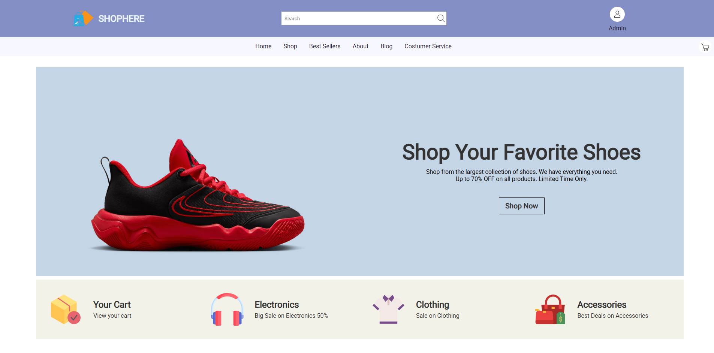
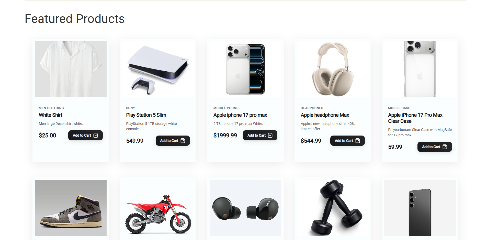
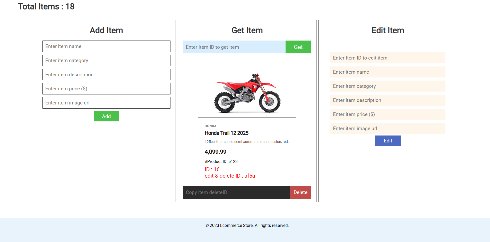

 # E-Commerce Website (Frontend Only)

This is a **simple e-commerce website** built with **HTML, CSS, JavaScript, and JSON only**.  
It does **not use any frameworks or backend**, making it a perfect learning project for frontend development.

---

<h1>📷 Screen Shots</h1>

  
  
  

---

## ⚙️ How It Works

- **HTML** → Provides the structure (pages like home, shop, product, cart).  
- **CSS**  → Adds design & styling (global + page-specific).  

- **JavaScript** → Makes pages interactive:
  - `shop.js`    → loads product list from `products.json`  
  - `product.js` → shows single product details  
  - `admin.js` → To manage the products

- **JSON** → Acts as a fake database (products & users).  
- **LocalStorage** → Used instead of a real backend for cart and user sessions.  

---

## 🚀 Features (Frontend Only)

✅ Home page with featured products  
✅ Shop page with dynamic product listing (from JSON)  
✅ Product details page (with query parameter `?id=`)  
✅ Admin Page to control Products  
---

## Notes

- This project is for **learning purposes only**.  
- There is **no backend** (no database, no authentication server).  
- Passwords are stored in plain text in localStorage → not secure!  
- A real e-commerce app would use a backend (Node, Django, PHP, etc.) + database.  

---

## How to Run

1. Download or clone this repo. 
2. Run json-server.
3. Open `index.html` in your browser.  
4. Navigate between pages normally.  
5. Products and users load from the `data/` folder.  

---

## Learning Goals

- Practice **HTML, CSS, JS** structure.  
- Learn to use **JSON** as fake data.  
- Learn **localStorage** for cart & login persistence.  
- Build a **realistic project structure** like professional frontend developers.  
